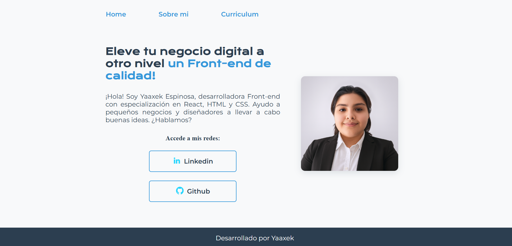

# 🌐 Portafolio Web  

Bienvenido a mi proyecto de **Portafolio Personal**, un sitio donde muestro mi trayectoria, habilidades y experiencia tanto en ingeniería como en desarrollo de software. 🚀  

  

## 📌 Descripción  

Este portafolio fue diseñado para destacar mi perfil como **desarrolladora Front-end en formación**, integrando mi experiencia previa en ingeniería con mis nuevas competencias en programación.  

El sitio cuenta con secciones de:  
- **Home** → Presentación y enlaces a mis redes.  
- **Sobre mí** → Mi camino profesional y motivación.  
- **Currículum** → Experiencias, formación académica y certificaciones.  

## 🛠️ Tecnologías utilizadas  

- **HTML5** → Estructura del sitio.  
- **CSS3** → Estilos, personalización y responsividad.  
- **Flexbox** → Layout adaptable en distintas pantallas.  
- **Media Queries** → Diseño responsivo para móviles, tablets y desktops.  
- **Git & GitHub** → Control de versiones y despliegue del repositorio.  

## 🌟 Características principales  

✔️ Diseño moderno y profesional.  
✔️ Página responsiva en todos los dispositivos.  
✔️ Código modular y escalable (HTML + CSS).  
✔️ Presentación clara de experiencias y certificaciones.  

## 📂 Repositorio  

👉 [Ver proyecto en GitHub](https://github.com/Yaaxek/Portafolio)  

## 👩‍💻 Autor  

**Yaaxek Astrid Espinosa Bouret**  

🔗 [LinkedIn](https://www.linkedin.com/in/yaaxek-astrid-espinosa-bouret)  
💻 [GitHub](https://github.com/Yaaxek)  
